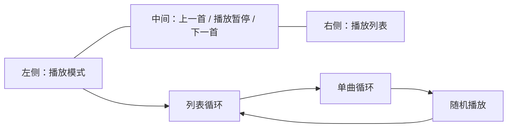

# PlayerLite

一个面向 Android 的音频播放器示例工程，基于 Compose + Media3 + FFmpeg + JNI + Native Cache Core 构建，当前已具备独立后台播放进程、系统媒体控制、本地/Content URI/HTTP(S) 音源播放、播放列表持久化恢复、播放模式控制、登录与用户会话基础设施，以及网络音频缓存能力。

## 当前能力

- 本地音频选择与播放，支持系统文件选择器返回的 `content://` 音源
- 自动申请并持久化 `content://` 读权限，应用重启后仍可恢复可播列表
- 后台独立 `:playback` 进程播放，基于 `MediaSessionService` 接入系统媒体通知、锁屏控制与外部控制器
- 系统媒体卡片点击可回到 App
- Native FFmpeg 解封装/解码，Native `AudioTrack` 输出 PCM
- 播放控制：播放、暂停、继续、上一首、下一首、seek、播放模式切换
- 播放模式：支持 `列表循环`（默认）、`单曲循环`、`随机播放`，主控区左侧通过图标入口循环切换并使用 Toast 提示结果
- 随机播放：仅在切入随机模式时生成随机顺序，支持 `显示原始顺序` 视图切换，且随机顺序与展示偏好支持重启恢复
- 倍速内核能力仍保留：支持 `0.5X` ~ `2.0X`、`0.1X` 步进，native 侧变速不变调；但主控区旧倍速入口已由播放模式占用，新的前台入口仍待后续规划
- 主控区入口：左侧播放模式入口、右侧播放列表入口，统一图标化 UI 风格与 badge 展示
- 播放完成后的推进规则由当前播放模式决定：列表循环回环、单曲循环重播当前项、随机播放按当前随机顺序推进
- 播放列表管理：新增、删除、激活项切换、拖拽排序、Bottom Sheet 展示；随机顺序视图下禁用拖拽，切回原始顺序后恢复
- 播放列表持久化与启动恢复，不可读项会在恢复阶段校验并过滤
- 输出链路信息透传展示：输入/输出采样率、声道数、编码格式、是否发生重采样
- `http/https` 网络音源播放，支持 Range 请求、边播边缓存、seek 取消在途读取
- 网络缓存支持内存 + 磁盘复用，并提供清理缓存入口
- 登录与用户会话：提供独立 `LoginActivity`，支持手机号/邮箱登录切换、欢迎页式首屏、右上角“跳过”入口，以及“登录仅作为受保护在线能力前置，本地播放不受影响”的产品流
- 用户资料与会话恢复：持久化保存当前用户会话和 `UserInfo` 快照，应用重启后可恢复登录状态，并支持获取用户详情、退出登录与失效降级
- 顶栏账户入口：未登录显示默认登录图标，已登录优先展示在线头像，头像缺失或加载失败时回退为默认人像图标
- 受保护在线播放前置卡口：为后续依赖登录态的在线能力提供统一准入判断，但不会污染本地播放、本地列表恢复或已有本地播放状态
- 内置 UI 测试流入口，便于验证本地 Range 服务与网络播放链路

## 模块划分

- `:app`
  - Compose UI、`PlayerViewModel`、播放页状态、`LoginActivity`、播放列表持久化与 UI 投影层 `PlayerRuntime`
- `:network-core`
  - 统一承载 `OkHttp + kotlinx.serialization` 网络基础设施、JSON 解码、请求执行与通用错误映射
- `:user`
  - 用户域能力边界，承载手机号/邮箱登录、`UserInfo` / `UserSession`、用户详情读取、登录状态恢复与退出登录
- `:playback-client`
  - `MediaController` 客户端桥接、命令派发、远端快照读取与映射
- `:playback-contract`
  - 跨模块共享的播放协议、`MusicInfo`、Session custom commands、metadata extras、受保护在线上下文与共享 DTO
- `:playback-service`
  - 独立播放进程宿主，提供 `MediaSessionService`、`PlayerSessionPlayer`、播放进程运行时与网络音源接入；仅消费前台已授权的受保护在线上下文
- `:player`
  - 播放器内核，暴露 Kotlin API，并通过 JNI 驱动 Native C++ + FFmpeg 播放
- `:cache-core`
  - Native-first 缓存核心，提供 `CacheCore`、`CacheSession`、`RangeDataProvider` 等能力，当前用于 `http/https` 音源缓存

## 支持的数据源

- `content://`：来自系统文件选择器，依赖持久化读权限
- `file://`：可直接读取的本地文件
- `http://` / `https://`：通过 Range 请求驱动的网络音源，接入 `cache-core` 做缓存和 seek

说明：

- seek 是否可用取决于当前 Source 能力；部分顺序读取源可能不支持快速 seek
- 网络音源当前聚焦 `http/https`，尚未在 README 范围内承诺 HLS/RTSP 等协议能力

## 核心架构

App 控制链路：

```text
MainActivity
  -> PlayerViewModel
  -> PlayerRuntime (UI projection)
  -> PlayerServiceBridge (:playback-client)
  -> PlayerMediaSessionService (:playback)
  -> PlayerSessionPlayer
  -> PlaybackProcessRuntime
  -> TrackPreparationCoordinator
  -> NativePlayer
  -> JNI / FFmpeg
  -> AudioTrack
```

Source 与解码链路：

```text
IPlaysource / IDirectReadableSource
  -> JniPlaySource
  -> FfmpegPlayer
  -> FfmpegDecoder
  -> AudioTrackConsumer
  -> AudioTrack
```

网络缓存链路：

```text
OkHttpRangeDataProvider
  -> CachedNetworkSource
  -> CacheCore / CacheSession
  -> memory + disk cache
  -> FFmpeg playback pipeline
```

用户会话链路：

```text
MainActivity
  -> InitialLoginLaunchGate
  -> LoginActivity (phone/email/skip)
  -> :user UserRepository
  -> :network-core JsonHttpClient
  -> remote login / user detail APIs
  -> persisted UserSession + UserInfo snapshot
  -> PlayerScreen top-right avatar entry
```

补充说明：

- 业务层播放列表状态负责维护原始顺序、随机顺序、当前激活项、播放模式与 `显示原始顺序` 偏好；后台播放服务消费的是投影后的当前生效队列
- `PlaybackProcessRuntime` 负责当前投影队列的执行态、seek、倍速与自然播完衔接；`PlayerRuntime` 保留 UI 局部状态、乐观更新与远端快照投影
- `:playback-contract` 用于隔离共享协议，避免 `:app` 直接依赖 `:playback-service` 内部实现包
- 受保护在线播放的登录卡口在前台业务层判断；`playback-service` 只接收已经附带有效授权上下文的在线播放请求
- 登录与用户资料能力收口在 `:user`，网络执行与 JSON 序列化能力收口在 `:network-core`，避免播放器 UI 直接散落账号逻辑与原始 JSON 解析
- `NativePlayer` 使用实例级 native context，避免多实例间状态污染
- JNI 读取链路优先尝试 `ByteBuffer` 直写，失败后自动回退到 `byte[]` 路径
- 播放状态、seek 能力、倍速、播放模式、音频元信息、输出链路信息等会通过 `MediaSession` extras/metadata 与 `playbackParameters` 回传给 UI

## 目录概览

```text
player-lite/
├── app/
├── network-core/
├── user/
├── playback-client/
├── playback-contract/
├── playback-service/
├── player/
├── cache-core/
├── third_party/FFmpeg-n6.1.4/
├── scripts/
├── openspec/
├── local-media-ui-test.mp3
└── README.md
```

关键路径：

- `app/src/main/java/com/wxy/playerlite/feature/player/`
- `app/src/main/java/com/wxy/playerlite/feature/user/`
- `app/src/main/java/com/wxy/playerlite/core/playlist/`
- `network-core/src/main/java/com/wxy/playerlite/network/core/`
- `user/src/main/java/com/wxy/playerlite/user/`
- `playback-client/src/main/java/com/wxy/playerlite/playback/client/`
- `playback-contract/src/main/java/com/wxy/playerlite/playback/model/`
- `playback-service/src/main/java/com/wxy/playerlite/playback/`
- `playback-service/src/main/java/com/wxy/playerlite/playback/process/source/`
- `player/src/main/java/com/wxy/playerlite/player/`
- `player/src/main/cpp/`
- `cache-core/src/main/java/com/wxy/playerlite/cache/core/`
- `cache-core/src/main/cpp/`

## 构建环境

建议环境：

- Android Studio（AGP 9.1.x）
- Android SDK `36`
- NDK `27.0.12077973`
- Java `11`
- Node.js `20+`（如需使用仓库内 OpenSpec / `.codex` 相关工作流，避免旧版 Node 无法运行 `openspec` CLI）

初始化 FFmpeg submodule：

```bash
git submodule update --init --recursive
```

构建 FFmpeg Android 动态库：

```bash
bash scripts/build_ffmpeg_android.sh
```

常用验证命令：

```bash
./gradlew :cache-core:testDebugUnitTest
./gradlew :playback-contract:testDebugUnitTest
./gradlew :playback-client:testDebugUnitTest
./gradlew :playback-service:testDebugUnitTest
./gradlew :app:testDebugUnitTest
./gradlew :app:assembleDebug
```

可选安装：

```bash
./gradlew :app:installDebug
```

## 运行与调试

### 0. 登录与账户入口

- 未登录启动应用时，会先进入欢迎页式 `LoginActivity`
- 右上角提供描边“跳过”按钮；点击后可直接进入主界面，继续使用本地播放
- 登录页支持 `手机号` / `邮箱` 两种登录方式切换，提交后都会建立同一套 `UserSession`
- 登录成功后，主界面右上角账户入口优先展示在线头像；头像不可用时安全回退默认人像图标
- 当前右上角头像入口仍作为轻量账户入口，后续可继续扩展为独立二级页面

### 主控区按钮语义



- 左侧按钮：当前用于播放模式切换，不再承载倍速入口
- 模式切换顺序：`列表循环 -> 单曲循环 -> 随机播放 -> 列表循环`
- 列表循环：当前列表按原始顺序推进，末尾点击下一首或自然播完后回到第一首
- 单曲循环：自然播完后重播当前项
- 随机播放：仅在切入随机模式时生成随机顺序；播放列表默认展示随机顺序，可切换查看原始顺序
- 右侧按钮：打开播放列表 Bottom Sheet，不参与播放模式切换

### 1. 本地音频播放

- 启动 App 后点击选文件按钮
- 通过系统文件选择器选择音频文件（`audio/*`）
- 选中的音频会加入播放列表，并由 App 侧保存持久化读权限与列表状态
- 主控区左侧点击可按 `列表循环 -> 单曲循环 -> 随机播放` 循环切换播放模式，右侧可打开播放列表
- 随机模式下，播放列表默认展示随机顺序，并可通过 `显示原始顺序` 切回原列表视图
- 当前曲目自然播放完成后的行为由模式决定：列表循环回到列表开头、单曲循环重播当前项、随机播放按当前随机顺序继续推进

### 2. 本地 HTTP Range 调试

仓库根目录已提供测试音频 `local-media-ui-test.mp3`，可配合脚本启动一个支持 Range 的本地服务：

```bash
python3 scripts/range_http_server.py --port 18080 --directory .
```

说明：

- Android 模拟器内通过 `http://10.0.2.2:18080/local-media-ui-test.mp3` 访问宿主机服务
- App 内的 UI 测试入口按钮会直接下发这个地址到后台播放进程
- 可用清理缓存按钮验证网络缓存清空后的重建流程

## 使用示例（播放器内核）

如果你只想直接使用 `:player` 模块能力，可按下面方式驱动本地文件播放：

```kotlin
val player: INativePlayer = NativePlayer()
val source = LocalFileSource(file)

source.setSourceMode(IPlaysource.SourceMode.NORMAL)
if (source.open() == IPlaysource.AudioSourceCode.ASC_SUCCESS) {
    val meta = player.loadAudioMetaDisplayFromSource(source)
    val result = player.playFromSource(source)
}

player.close()
source.close()
```

说明：

- 在完整 App 中，播放控制主路径通常走 `PlayerServiceBridge` -> `PlayerMediaSessionService` -> `PlaybackProcessRuntime`，而不是 UI 直接调用 `NativePlayer`
- `loadAudioMetaDisplayFromSource()` 可用于读取 `codec / sampleRate / channels / bitRate / duration`

## 常见返回码（部分）

- `0`：成功
- `-2001`：已停止
- `-2003`：时长不可用
- `-2005`：同一播放器实例正在播放（防重入）
- `-2006`：当前状态不允许 seek
- `-3001`：`AudioTrack` 初始化失败
- `-4 / -5`：Source 初始化或打开失败
- `-6`：Native 上下文不可用

其余负值可能来自 FFmpeg、Source 或缓存/播放流程内部错误，建议结合 `lastError()` 与日志一起排查。

## 当前版本重点

- 已完成独立后台播放进程与 `MediaSession` 集成
- 已完成 `:playback-client` / `:playback-contract` / `:playback-service` 分层拆分
- 已新增 `:network-core` / `:user` 模块，收口登录、用户会话与网络基础能力
- 已完成播放列表管理与持久化恢复
- 已引入 `:cache-core`，打通 `http/https` 网络播放缓存主链路
- 已支持清理缓存、自定义测试流入口与输出链路信息展示
- 已完成播放模式控制、随机双顺序播放列表与 `MediaSession` 播放模式投影
- 已完成欢迎页式 `LoginActivity`、手机号/邮箱登录、用户会话持久化恢复与右上角头像入口
- Native Source 读取链路已支持 direct buffer 优先与兼容回退

## 后续可演进方向

- 扩展更多网络协议与更完整的流媒体场景
- 在当前头像入口基础上扩展完整账户二级页面与更多用户态展示
- 丰富缓存可观测性与缓存命中分析工具
- 重新安置倍速入口并补全对应前台交互
- 扩展通知栏 / 外部控制器对播放模式的可见性与交互能力
- 完善 UI 自动化与真机网络回归测试覆盖
